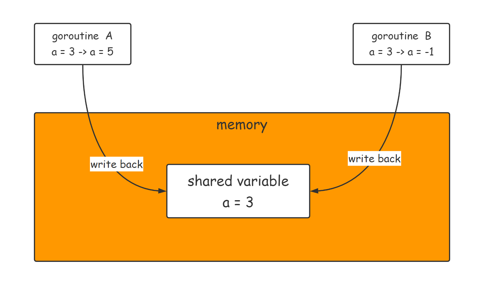
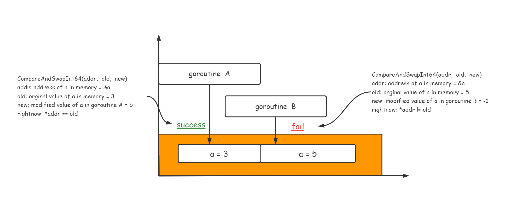
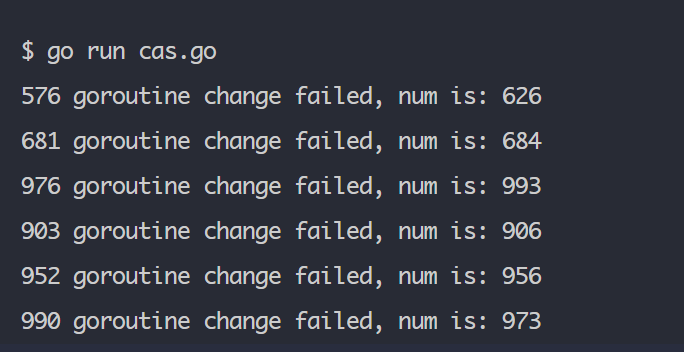

# What is CAS

**compare-and-swap (CAS)** is an atomic instruction used in multithreading to achieve synchronization.      

CAS is the fundamental for implementing optimistic locking.         

In CAS you don't have to use lock to ensure secure in multithreading condition, 

## Illustrate with Pictures
       




## Use CAS in go

Go standard library provides several functions      

```go
func CompareAndSwapInt32(addr *int32, old, new int32) (swapped bool)

func CompareAndSwapInt64(addr *int64, old, new int64) (swapped bool)

func CompareAndSwapUint32(addr *uint32, old, new uint32) (swapped bool)

func CompareAndSwapUint64(addr *uint64, old, new uint64) (swapped bool)

func CompareAndSwapUintptr(addr *uintptr, old, new uintptr) (swapped bool)

func CompareAndSwapPointer(addr *unsafe.Pointer, old, new unsafe.Pointer) (swapped bool)
```         


There is a CAS demo written by go in **cas.go**     

As result when the `threadNum` is et to **1000**, the function **CompareAndSwapInt64** start to fail            




